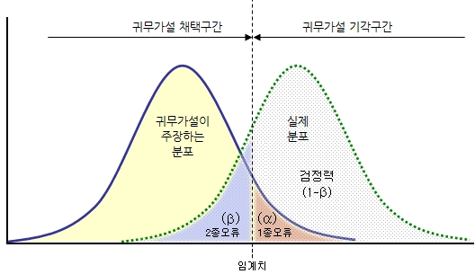

# A/B 테스트 설계 기초 (4): 실제 실험 운영 설계

[← 이전 글](04-experimental-unit.md) · [목차](README.md) · [다음 글 →](06-interference.md)

## 4. 실험 규모와 무작위 배정 설계

### 4.1 유의수준과 검정력이 실험 설계에 미치는 영향

A/B 테스트에서는 실험을 시작하기 전에 **얼마나 큰 오류까지 허용할 것인지**를 정해야 합니다. 이 기준이 바로 유의수준($`\alpha`$)과 검정력(Power)이며, 두 값은 이후 필요한 표본 수와 실험 기간을 결정하는 핵심 입력값이 됩니다.



#### 4.1.1 유의수준($`\alpha`$)과 1종 오류

<strong>1종 오류(False Positive)</strong>는 실제로는 Treatment 효과가 없는데도 효과가 있다고 판단하는 오류입니다.

예를 들어 새로운 결제 화면이 기존 화면과 실제 차이가 없는데 실험 결과만 보고 “전환율이 개선됐다”고 판단해 배포하는 경우입니다.

유의수준($`\alpha`$)은 이러한 1종 오류를 어느 정도까지 허용할지를 나타냅니다.

일반적으로 $`\alpha=0.05`$를 사용하면, <strong>효과가 없는 상황에서 잘못 효과가 있다고 판단할 위험을 5% 수준으로 제한하겠다</strong>는 의미입니다.

\*다만 0.05는 절대적인 정답이 아니라 관행적으로 많이 사용하는 기준입니다. False Positive의 비용이 매우 크다면 더 작은 $`\alpha`$를 선택할 수도 있습니다.

#### 4.1.2 검정력($`1-\beta`$)과 2종 오류

<strong>2종 오류(False Negative)</strong>는 실제로 Treatment 효과가 있는데도 효과가 없다고 판단하는 오류입니다.

예를 들어 새로운 추천 알고리즘이 실제로 구매율을 높이지만 표본이 부족해 통계적으로 차이를 발견하지 못하는 경우입니다.

2종 오류가 발생할 확률을 $`\beta`$라 하고, $`1-\beta`$를 검정력(Power)이라고 합니다.

즉 Power는 <strong>실제로 우리가 탐지하려는 크기의 효과가 존재할 때, 실험이 그 효과를 발견할 확률</strong>이라고 이해하면 됩니다.

예를 들어 Power가 80%라면, 설계할 때 가정한 크기의 효과가 실제로 존재한다고 했을 때 이를 통계적으로 탐지할 확률을 80%로 설정한 것입니다.

#### 4.1.3 가장 중요한 부분: 실험 규모에 어떤 영향을 미치는가?

$`\alpha`$와 Power는 단순히 마지막에 통계 검정을 할 때 사용하는 숫자가 아닙니다. <strong>실험을 시작하기 전에 필요한 표본 수를 결정하는 값</strong>입니다.

기본적인 관계는 다음과 같습니다.

<table header-row="true">
<tr>
<td>설계 변경</td>
<td>의미</td>
<td>필요한 표본 수</td>
</tr>
<tr>
<td>$`\alpha`$ ↓</td>
<td>False Positive를 더 엄격하게 방지</td>
<td>증가</td>
</tr>
<tr>
<td>$`\alpha`$ ↑</td>
<td>효과 있다고 판단하기 쉬워짐</td>
<td>감소</td>
</tr>
<tr>
<td>Power ↑</td>
<td>실제 효과를 놓칠 가능성을 줄임</td>
<td>증가</td>
</tr>
<tr>
<td>Power ↓</td>
<td>실제 효과를 놓칠 가능성을 더 허용</td>
<td>감소</td>
</tr>
</table>

결국 관계는 다음처럼 이어집니다.

```text
α / Power 결정
        ↓
필요한 표본 수 결정
        ↓
서비스 트래픽과 결합
        ↓
필요한 실험 기간 결정
```

예를 들어 하루에 실험 대상 사용자가 10,000명이고 필요한 표본이 총 140,000명이라면 단순하게는 약 14일 정도의 트래픽이 필요합니다.

따라서 <strong>“얼마나 엄격하게 검정할 것인가?”라는 통계적 선택은 곧 “실험을 얼마나 오래 돌려야 하는가?”라는 제품 운영의 문제로 연결됩니다.</strong>

#### 4.1.4 실험 설계에서는 어떻게 정해야 할까?

핵심은 두 종류의 실수를 비교하는 것입니다.

- **False Positive:** 효과 없는 기능을 효과 있다고 판단해 배포하면 얼마나 큰 문제가 생기는가?
- **False Negative:** 실제로 좋은 기능인데 효과가 없다고 판단해 버리면 얼마나 큰 기회를 잃는가?

False Positive의 비용이 중요하다면 $`\alpha`$를 더 엄격하게 설정할 수 있고, 실제 효과를 놓치고 싶지 않다면 Power를 높일 수 있습니다. (하지만 두 경우 모두 더 많은 표본과 더 긴 실험 기간을 요구한다는 Trade-off가 존재합니다.)

### 4.2 MDE와 표본 크기 산정

A/B 테스트를 시작하기 전에 먼저 정해야 하는 것 중 하나가 <strong>얼마나 작은 차이까지 탐지하고 싶은지</strong>, 그리고 그 차이를 탐지하려면 <strong>얼마나 많은 표본이 필요한지</strong>입니다.

그렇기에 프로덕트 팀과 A/B 테스트를 진행하면서 겪게 되는 골치 아픈 부분 중 하나는 Minimum Detectable Effect(`MDE`) 값을 정하는 것인데요.

#### 4.2.1 MDE(Minimum Detectable Effect)의 의미

> MDE는 A/B 테스트에서 감지할 수 있는 가능한 가장 작은 “효과”가 아니다.

<strong>MDE(Minimum Detectable Effect)</strong>는 주어진 유의수준과 검정력에서 <strong>실험이 일정한 확률로 탐지하도록 설계한 최소 효과 크기</strong>입니다.

예를 들어 현재 전환율이 10%이고,

```text
Baseline CVR = 10%
MDE = +1%p
Power = 80%
```

라고 설정했다면, <strong>“약 `10% → 11%` 정도의 변화가 실제로 존재할 때 이를 충분한 확률로 탐지할 수 있도록 실험을 설계하겠다”</strong>는 의미입니다.

여기서 중요한 점은 <strong>MDE보다 작은 효과가 절대로 유의하게 나오지 않는다는 뜻은 아니라는 것</strong>입니다.

따라서 MDE는 “이보다 작은 차이는 절대 발견하지 못한다”가 아니라 <strong>“우리가 이 정도의 차이는 신뢰할 만한 확률로 발견할 수 있도록 실험을 설계하겠다”</strong>는 기준에 가깝습니다.

#### 4.2.2 MDE가 중요한 이유

위에서도 언급했듯이, 탐지하려는 효과가 작을수록 더 많은 표본이 필요합니다.

큰 변화는 적은 데이터로도 Control과 Treatment의 차이를 구분하기 쉽지만, 아주 작은 변화는 우연한 변동과 구분하기 어렵기 때문입니다.

따라서 MDE는 단순한 통계 파라미터가 아니라 <strong>실험 비용과 기간을 결정하는 중요한 설계 변수</strong>입니다.

#### 4.2.3 적절한 MDE는 어떻게 정할까?

> <strong>이 기능을 실제로 도입할 가치가 있다고 판단할 최소한의 효과는 무엇인가?</strong>

MDE를 무조건 작게 설정한다고 좋은 실험이 되는 것은 아닙니다.

예를 들어 새로운 기능을 완전히 구현하려면 상당한 개발 비용이 들고, 그 비용을 정당화하려면 전환율이 최소 5%는 개선되어야 가치가 있다고 해봅시다.

그런데 실험을 MDE = 0.5% 수준까지 탐지할 수 있도록 설계한다면, 비즈니스적으로 별 의미 없는 작은 효과까지 잡기 위해 훨씬 많은 표본과 시간을 사용하게 됩니다. <strong>(Overpowered Test)</strong>

반대로 MDE = 50%와 같이 지나치게 크게 잡아버리면, 실제로 20~30% 정도의 의미 있는 개선이 있어도 이를 안정적으로 발견하지 못할 수 있습니다. <strong>(Underpowered Test)</strong>

모든 실험에 공통으로 적용되는 표준 MDE는 없습니다. 실험에 들어가는 비용, 리스크, 기대 효과를 고려해 MDE를 정해야 합니다.

이를 위해 간단한 ROI(Return on Investment) 계산을 활용할 수 있습니다.

즉 MDE는 통계팀이 임의로 정하는 숫자가 아니라 <strong>제품/비즈니스 의사결정과 함께 정해야 하는 값</strong>입니다.

#### 4.2.4 Power Analysis와 필요한 표본 수

표본 크기를 결정하는 요소는 다음과 같습니다.

① <strong>Baseline Rate / 분산</strong>: <strong>분산은 지표가 원래 얼마나 많이 흔들리는지를 의미합니다.</strong> 같은 크기의 Treatment 효과가 있어도 데이터 자체의 변동이 크면 그 차이가 실제 효과인지 우연한 변동인지 구분하기 어렵습니다.

② **MDE**: 더 작은 효과까지 탐지하려 할수록 표본 수가 증가합니다.

③ <strong>유의수준 $`\alpha`$</strong>: 유의수준을 작게 설정할수록 False Positive에 더 엄격한 실험이 되기 때문에 더 많은 데이터가 필요합니다.

④ **Power**: Power를 높이면 실제 효과가 존재할 때 이를 놓칠 확률을 낮출 수 있습니다.

\*Baseline Rate의 영향은 지표 형태에 따라 달라지므로 단순히 “Baseline이 높으면 표본이 증가한다”고 외우는 것은 적절하지 않습니다.

MDE가 정해지면 앞에서 정한 유의수준과 검정력 등을 이용해 얼마나 많은 표본이 필요한지 계산할 수 있습니다.

이 과정을 일반적으로 **Power Analysis**라고 합니다.

#### 4.2.5 필요한 표본 수와 실험 기간의 관계

필요 표본 수가 정해지면 서비스의 트래픽을 이용해 예상 실험 기간을 계산할 수 있습니다.

즉 전체적인 순서는 다음과 같습니다.

`비즈니스적으로 의미 있는 효과` → `MDE 설정` → `α / Power 설정` → `필요 표본 수` → `서비스 트래픽` → `예상 실험 기간`

“실험을 일주일 돌리자”처럼 기간부터 정하고 MDE를 역으로 맞추기보다, <strong>먼저 비즈니스적으로 타당한 MDE를 정한 뒤 그에 따라 표본 크기와 실험 기간을 결정하는 것이 바람직</strong>합니다.

### 4.3 무작위 배정 방식 설계

A/B 테스트에서 무작위 배정의 목적은 단순히 사용자를 A와 B로 나누는 것이 아닙니다. <strong>Treatment 외의 조건이 두 그룹에서 최대한 비슷하도록 만들어, 관측된 차이를 Treatment의 효과로 해석할 수 있게 하는 것</strong>이 핵심입니다.

#### 4.3.1 Simple Randomization

각 실험 단위를 독립적으로 Control 또는 Treatment에 무작위 배정하는 가장 기본적인 방식입니다.

표본이 충분히 크다면 사용자 특성이 두 그룹에 대체로 고르게 분포합니다. 다만 표본이 작거나 중요한 특성이 한쪽에 우연히 몰리면 그룹 간 불균형이 생길 수 있습니다.

#### 4.3.2 Stratified Randomization

실험 결과에 큰 영향을 줄 수 있는 특성을 기준으로 사용자를 먼저 나눈 뒤, <strong>각 층(Stratum) 안에서 다시 무작위 배정하는 방식</strong>입니다.

예를 들어 신규/기존 사용자의 행동 차이가 크다면:

```text
신규 사용자 → A/B 무작위 배정
기존 사용자 → A/B 무작위 배정
```

처럼 구성할 수 있습니다.

이 방식은 중요한 특성이 한 그룹에 우연히 몰리는 것을 줄여 <strong>Control과 Treatment의 비교 가능성을 높이는 데</strong> 도움이 될 수 있습니다.

#### 4.3.3 Hash-based Assignment

<strong>사용자 식별자와 실험 ID 등을 해시 함수에 입력해 결괏값을 얻고, 이를 바탕으로 A/B 테스트 등의 실험군(Variant)을 결정하는 결정론적이고 상태가 없는(Stateless) 기법</strong>입니다.

```text
hash(user_id, experiment_id)
        ↓
0 ~ 9999 bucket
        ↓
0~4999     → Control
5000~9999  → Treatment
```

온라인 실험에서는 `user_id` 같은 식별자와 `experiment_id` 등을 해시 함수에 넣어 일정한 bucket으로 변환한 뒤 Variant를 결정하는 방식이 많이 사용됩니다.

같은 입력은 항상 같은 결과를 만들기 때문에 <strong>배정을 재현하기 쉽고 대규모 트래픽에서도 안정적으로 그룹을 나눌 수 있다는 장점</strong>이 있습니다. Simple Randomization과의 차이는 온라인 환경에서 무작위에 가까운 배정을 일관되게 구현하는 방법에 가깝다는 것입니다.

#### 4.3.4 50:50 배정과 비대칭 배정

두 그룹의 조건이 같다면 일반적으로 <strong>50:50 배정이 같은 전체 표본 수에서 비교 효율이 좋습니다.</strong>

예를 들어 새로운 기능에 장애 위험이 있다면:

```text
Control   90%
Treatment 10%
```

처럼 일부 사용자에게 먼저 노출할 수 있습니다.

다만 Treatment 비율을 줄이면 Treatment 쪽 표본이 천천히 쌓이므로 <strong>같은 검정력을 확보하기 위해 전체적으로 더 많은 트래픽이나 시간이 필요할 수 있습니다.</strong>

따라서 비대칭 배정은 통계적 효율보다는 <strong>위험 관리, 비용, 트래픽 제약</strong> 등의 이유로 선택하는 경우가 많습니다.

#### 4.3.5 배정 방식이 실험 결과의 신뢰성에 미치는 영향

좋은 무작위 배정이 이루어졌다면 두 그룹은 평균적으로 Treatment 여부를 제외한 다른 조건이 비슷해집니다.

따라서 두 그룹에서 차이가 발생했을 때 이를 <strong>Treatment의 인과효과로 해석할 근거</strong>가 생깁니다.

즉 A/B 테스트에서 중요한 것은 단순히 <strong>A와 B의 사용자 수를 비슷하게 만드는 것</strong>이 아니라, <strong>Treatment 여부와 사용자 특성이 체계적으로 연결되지 않도록 배정하는 것</strong>입니다.

그래서 실험을 설계할 때는 적어도 <strong>어떤 단위를 어떤 규칙으로 배정할지, 배정 비율은 얼마인지, 필요한 경우 어떤 특성을 균형화할지</strong>를 실험 시작 전에 정해두어야 합니다.

## Reference

- [A/B 테스트를 위한 통계 기초와 가설 설정 - Part 7. 가설검정의 논리](https://datarian.io/blog/ab-test-statistics-part-7-logic-of-hypothesis-testing)
- [A/B 테스트를 위한 통계 기초와 가설 설정 - Part 4. 표본 비율](https://datarian.io/blog/ab-test-statistics-part-4-sample-proportion)
- [A/B 테스트에서 의미있는 효과 기준(MDE)을 설정하는 방법](https://playinpap.github.io/abtest-setting-mde)
- [구글 애널리틱스 A/B 테스트 쉽게 하기(쿠키 + dimension 활용)](https://medium.com/daangn/%EA%B5%AC%EA%B8%80-%EC%95%A0%EB%84%90%EB%A6%AC%ED%8B%B1%EC%8A%A4-a-b-%ED%85%8C%EC%8A%A4%ED%8A%B8-%ED%95%98%EA%B8%B0-%EC%BF%A0%ED%82%A4-demension-%ED%99%9C%EC%9A%A9-6f994e1247e8)
- [A/B테스트 기초(what, why, how)](https://medium.com/wantedjobs/a-b%ED%85%8C%EC%8A%A4%ED%8A%B8-%EA%B8%B0%EC%B4%88-what-why-how-6f571ddc19fc)
- [How to use hash functions for split test assignment \| Mojito](https://mojito.mx/docs/example-hash-function-split-test-assignment/)
