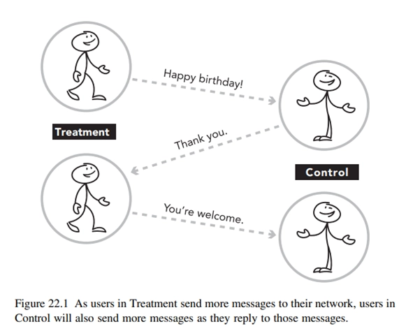
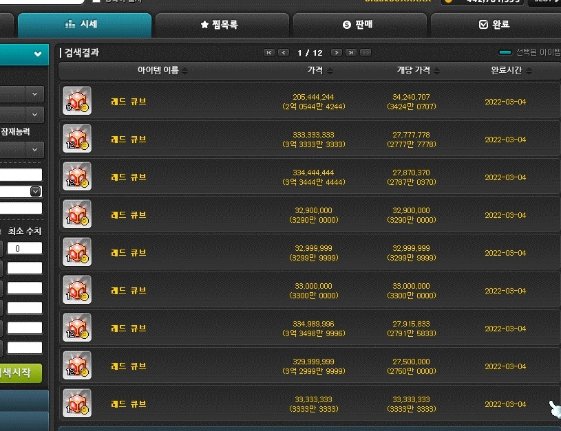

# 신뢰할 수 있는 A/B 테스트의 조건 (1): 간섭(Interference) 문제

[← 이전 글](05-experiment-operations.md) · [목차](README.md) · [다음 글 →](07-interference-solutions.md)

> **작성 상태:** 원문이 진행 중이며, 1장(간섭 문제)까지 작성되어 있습니다. 해결 방법은 [다음 글](07-interference-solutions.md)에서 다룹니다.

앞의 글들이 A/B 테스트를 하는 법을 다뤘다면, 이 글은 A/B 테스트 결과를 믿어도 되는가를 다룹니다.

## 1. A/B 테스트에서의 간섭(Interference) 문제


좋은 통제 실험의 조건 중 하나는 실험군 사용자가 대조군 사용자에게 영향을 미치지 않는 것입니다.

A/B 테스트의 목적은 보통 “B를 적용했더니 지표가 얼마나 변했는가?”를 통해 **인과효과**를 추정하는 것이기 때문인데요.

### 1.1 A/B 테스트의 기본 가정: SUTVA

일반적인 A/B 테스트에서는 한 사용자가 받은 Treatment가 **다른 사용자의 결과에 영향을 주지 않는다**고 가정합니다. A그룹과 B그룹이 서로 독립적이어야 Treatment Effect를 비교할 수 있기 때문이죠.

이러한 가정을 **SUTVA**(Stable Unit Treatment Value Assumption)라고 하고, A/B 테스트의 내적타당성을 유지하는 데 중요한 가정입니다.

#### 1.1.1 Interference(간섭)

그리고 이 가정이 깨지는 현상을 <strong>Interference(간섭)</strong>이라고 합니다. (통계 용어이며, 실무에서는 같은 현상을 Spillover, Leakage라고도 부릅니다.)

간섭이 있으면 실제 Treatment의 효과를 과대/과소평가할 수 있고, A/B 테스트의 인과 추론 자체가 흔들립니다.

\[참고\]

- Spillover: Treatment의 영향이 다른 그룹으로 넘쳐 흐르는 것. 가장 널리 쓰이는 실무 용어
- Leakage: 주로 Treatment 경험이 Control로 새는 상황. 문맥상 spillover와 거의 같게 쓰이지만 실험 오염 뉘앙스가 강하다.

#### 1.1.2 직접 간섭과 간접 간섭

Interference(간섭)은 발생 경로에 따라 크게 <strong>직접 간섭(Direct Interference)</strong>과 <strong>간접 간섭(Indirect Interference)</strong>으로 나눠볼 수 있습니다.

- <strong>직접 간섭(Direct Interference): Treatment를 받은 사용자의 행동 변화가 다른 사용자에게 직접 영향을 주는 경우입니다.</strong> 주로 사용자간 상호작용이나 연결 관계가 있는 서비스에서 발생합니다.
- <strong>간접 간섭(Indirect Interference): 사용자끼리 직접 상호작용하지 않더라도, 공유된 자원이나 시장 환경을 통해 다른 그룹에 영향을 주는 경우입니다.</strong>

	예를 들어 배달 앱에서 Treatment 그룹의 주문이 증가해 라이더가 부족해지고, 그 결과 Control 그룹의 배달 시간이 증가하는 경우가 이에 해당합니다.

### 1.2 직접 간섭 - 네트워크 효과



<strong>SNS, 메신저, 게임, Marketplace처럼 사용자 간 상호작용이 서비스 자체의 핵심인 경우,</strong> 한 사용자의 Treatment가 연결된 다른 사용자에게 영향을 주기 쉽습니다.

예를 들어 SNS의 새로운 공유 기능을 일부 사용자에게만 제공한다고 해보겠습니다.

- Treatment 사용자
- 공유량 증가
- 친구의 피드 노출 증가
- Control 사용자의 행동 변화

Control 사용자는 새로운 기능을 직접 받지는 않았지만, Treatment 사용자의 행동 변화 때문에 결과가 달라졌습니다. 이런 경우 사용자 단위 A/B 테스트의 No Interference 가정이 깨지게 됩니다.

### 1.3 간접 간섭 - 공유 자원에 의한 간섭

사용자들이 서로 직접 연결되어 있지 않더라도, 한정된 자원이나 동일한 시장을 공유하는 경우 Treatment의 영향이 Control 그룹까지 전달될 수 있습니다.

Treatment 그룹의 행동이 공유 자원의 수요나 공급을 변화시키고, 그 결과 Control 그룹이 경험하는 환경까지 달라지는 것입니다.

메이플스토리를 예시로 생각해볼까요?



메이플스토리 내의 메이플 옥션은 같은 아이템 매물을 여러 사용자가 함께 보고 구매하는 구조고, 일괄 구매 시 낮은 가격의 매물부터 소진되며, 등록 수량이 부족하면 일부만 구매되거나 구매에 실패할 수 있습니다.

즉, <u><strong>매물이 한정된 공유자원</strong></u>인데요.

여기서 Treatment 그룹에만 ‘저가 매물 자동 일괄 구매’ 기능을 제공한다고 해봅시다.

그러면 Treatment 유저는 싼 매물을 더 빠르게 대량 구매하고, 이로 인해 경매장 내 저가 매물이 감소할 것입니다. 그러면 Control 유저가 볼 수 있는 매물의 평균 가격은 상승하게 되겠죠.

Control 유저는 새 기능을 받은 적이 없는데도 Treatment 유저가 경매장 재고를 소진했기 때문에 경험이 변했습니다.

다른 예시로는 아래와 같은 사례가 있습니다.

- Airbnb: Treatment 사용자의 예약 증가 → Control이 예약할 숙소 감소
- Uber/Lyft: Treatment 사용자의 호출 증가 → Control이 이용할 수 있는 드라이버 감소
- 광고: Treatment에서 광고비 소진 → Control에 남는 예산 감소
- 서버: Treatment의 요청량 증가 → 서버 부하 증가 → Control도 느려짐

특히 Lyft 같은 양면시장에서는 한 이용자의 처리가 다른 이용자의 이용 가능 자원 자체를 바꾸기 때문에 단순 사용자 단위 Randomization이 SUTVA를 위반할 수 있습니다.

### 1.4 간섭이 실험 결과에 미치는 영향

간섭이 발생하면 Treatment와 Control이 더 이상 완전히 분리된 집단으로 기능하지 못합니다. 그 결과 A/B 테스트에서 관측한 두 집단의 차이를 순수한 Treatment의 인과효과로 해석하기 어려워집니다.

#### 1.4.1 Control Contamination

Control 그룹은 원래 Treatment를 받지 않은 상태의 결과를 보여줘야 합니다. 하지만 간섭으로 인해 Control 그룹이 Treatment의 영향을 받으면 <strong>Control contamination(대조군 오염)</strong>이 발생합니다.

이 경우 Control 그룹이 더 이상 올바른 기준선(Baseline)이 아니기 때문에 Treatment와 Control의 단순 비교가 왜곡됩니다.

#### 1.4.2 Treatment Effect의 과대·과소 추정

일반적인 A/B 테스트에서는

```math
\text{Treatment Effect} = E[Y \mid T=1]-E[Y \mid T=0]
```

와 같이 두 집단의 결과 차이를 Treatment의 효과로 해석합니다.

하지만 간섭이 존재하면 한 사용자의 결과가 본인이 받은 Treatment뿐 아니라, 다른 사용자에게 배정된 Treatment의 영향까지 받을 수 있습니다.

#### 1.4.3 ATE의 의미가 불명확해짐

일반적인 ATE(Average Treatment Effect)는 동일한 사용자가 $`T=1`$ 을 받았을 때와 $`T=0`$ 을 받았을 때의 결과 차이를 모집단 전체에서 평균낸 개념입니다.

그런데 간섭이 존재하면 사용자의 결과가 자신의 Treatment 하나만으로 결정되지 않습니다.

$`Y_i(T_i)`$가 아니라, $`Y_i(T_1,T_2,\ldots,T_n)`$처럼 **다른 사용자들에게 어떤 Treatment가 배정되었는지까지 고려해야 할 수 있습니다.**

그래서 누가 Treatment를 받았는가뿐 아니라 전체 모집단 중 얼마나 많은 사용자가 Treatment를 받았는가에 따라서도 효과가 달라질 수 있습니다.

#### 1.4.4 실험 결과와 전체 적용 효과가 달라질 수 있음

A/B 테스트에서는 일반적으로 일부 사용자만 Treatment를 받습니다.

간섭이 존재하면 Treatment 사용자의 비율 자체가 다른 사용자의 결과에 영향을 줄 수 있기 때문에, <strong>부분적으로 적용했을 때 측정한 효과와 전체에 적용했을 때 발생하는 효과가 서로 다를 수 있습니다.</strong>

따라서 A/B 테스트 결과를 그대로 전체 서비스 적용 효과로 해석하기 어렵습니다.

#### 1.4.5 통계적 유의성이 있어도 인과적으로 올바르다고 할 수 없음

간섭 문제는 단순히 p-value나 표본 크기를 늘려 해결할 수 있는 문제가 아닙니다. 실험 설계의 가정 자체가 깨진 상태라면 통계적으로 유의한 결과가 나오더라도, <strong>실제 인과효과를 추정한 것인지</strong>는 별개의 문제입니다.

또한 사용자들의 결과가 서로 영향을 주면 관측값 사이의 독립성도 약해질 수 있어, 일반적인 분석에서 사용하는 <strong>표준오차(Standard Error)나 신뢰구간</strong> 역시 부정확해질 가능성이 있습니다.

## Reference

- Trustworthy Online Controlled Experiments : A Practical Guide to A/B Testing
- [https://experimentguide.com/](https://experimentguide.com/)
- [\[인과추론\] A/B Test 설계 시 실험군 간의 누출 및 간섭](https://ysyblog.tistory.com/408)
- [Violation of SUTVA in A/B Testing: network interference \| Jongmin Mun](https://jong-min.org/blog/2025/exp-network-interference/)
- [OCE-Materials/발표 자료/20240528_실험간의 누출 및 간섭.pdf at main · CausalInferenceLab/OCE-Materials](https://github.com/CausalInferenceLab/OCE-Materials/blob/main/%EB%B0%9C%ED%91%9C%20%EC%9E%90%EB%A3%8C/20240528_%EC%8B%A4%ED%97%98%EA%B0%84%EC%9D%98%20%EB%88%84%EC%B6%9C%20%EB%B0%8F%20%EA%B0%84%EC%84%AD.pdf)
- [Causal Inference Workshop 2022 - Applications of Causal Inference in Product Analytics (SlideShare)](https://www.slideshare.net/slideshow/causal-inference-workshop-2022-applications-of-causal-inference-in-product-analytics/267698546)
- [\[메이플스토리\] 메이플옥션(경매장)에 대해 알아보자.](https://edmblackbox.tistory.com/810)
